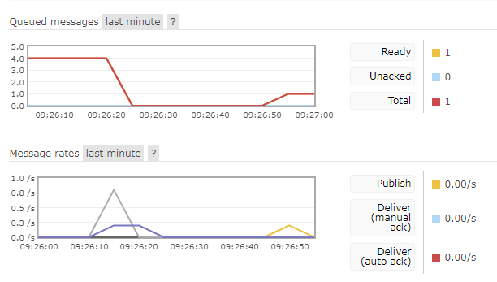

# RabbitMQ-SpringBoot-Example
Example RabbitMQ SpringBoot

## Start the Application with the help of Docker
Go to the project directory and execute the following command in the terminal

`docker-compose up`

And we are done, the SpringBoot App will be starting on port 8080 and RabbitMQ is on 5672 and RabbitMQ Management on 15672

## For just run Rabbitmq on Docker
  
  `docker run -d --name my-rabbit -p 4369:4369 -p 5671:5671 -p 5672:5672 -p 15672:15672 rabbitmq:3.9-management`
 
then you can enable its management plugins while that container runs using the following command:

`docker container exec -it my-rabbit rabbitmq-plugins enable rabbitmq_management`
  
## Send and Receive data

POST: 

http://localhost:8080/sendMessage

Body:
`{
    "title":"Hello, RabbitMQ",
    "text":"This is my message",
    "sender":"admin"
}`

GET:

http://localhost:8080/getMessage

